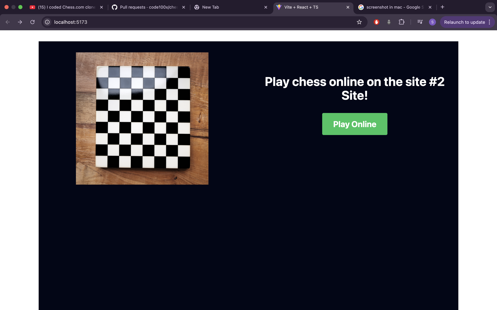
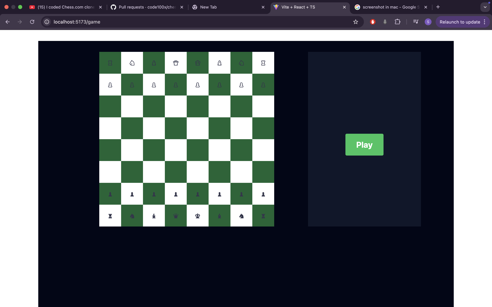

# chess.com-clone

This repository contains a **Chess.com Clone** built to replicate the essential features and interface of the popular online chess platform, Chess.com. The project showcases skills in front-end and back-end development with an emphasis on functionality, responsiveness, and user experience.

---

## Features

- 🕹️ **Play Chess**: Engage in real-time chess games.
- 🔍 **Find Opponents**: Match with players of similar skill levels.
- 🎨 **Responsive UI**: Optimized for desktops, tablets, and mobile devices.
- 📈 **Leaderboards**: Compare your rank with other players.

---

## Tech Stack

- **Frontend**: React.js, CSS, typeScript
- **Backend**: Node.js, Express.js
- **Version Control**: Git & GitHub

---

## Installation

Follow these steps to set up the project locally:

1. Clone this repository:
   ```bash
   git clone git@github.com:snehab03/chess.com-clone.git
2. Navigate to the project directory:
   ```bash
    cd chess.com-clone
3. Install dependencies:
   ```bash
   npm install
4. Start the development server:
   ```bash
   npm start
5. Access the app in your browser:
URL: http://localhost:3000

## Screenshots
### Home Page


### Gameplay


Happy coding! ♟️
